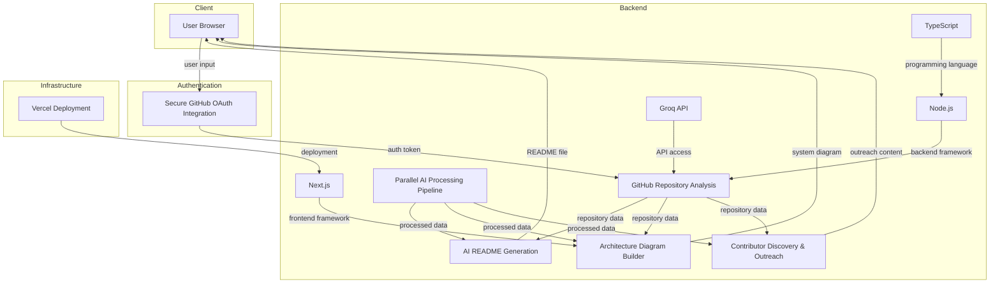

# intentmesh
- [](https://opensource.org/licenses/Apache-2.0)
- []()
- []()
- []()

> **Transform GitHub repositories into professional documentation, system diagrams, and contributor-ready content in seconds**

## Why intentmesh Exists
Most repositories struggle with poor documentation, missing architecture visibility, and limited contributor onboarding. Creating high-quality READMEs, diagrams, and outreach material manually takes time and often becomes an afterthought. This lack of documentation and visibility not only hinders the growth of open-source projects but also makes it difficult for new contributors to join and contribute to these projects.

IntentMesh was built to automate repository understanding and documentation generation using AI. It analyzes repositories, detects technologies and architecture patterns, and produces production-ready documentation, visual system diagrams, and contributor discovery insights to help developers ship more professional and maintainable open-source projects. By leveraging AI, IntentMesh aims to bridge the gap between repository owners and potential contributors, fostering a more collaborative and sustainable open-source ecosystem.

The need for a tool like IntentMesh is evident in the open-source community, where many projects suffer from inadequate documentation and limited visibility. By providing an automated solution for generating high-quality documentation and diagrams, IntentMesh can help repository owners save time and focus on what matters most - building and maintaining their projects.

## ✨ Features
**AI README Generation** — Automatically generates structured, production-ready README files using repository analysis, detected architecture, project metadata, and user customization inputs. This feature enables repository owners to create high-quality documentation quickly and efficiently, without having to spend hours writing and formatting their README files.

**Architecture Diagram Builder** — Creates Mermaid-based system diagrams by inferring frontend, backend, database, infrastructure, and workflow relationships from repository technologies and project structure. This feature provides a visual representation of a project's architecture, making it easier for developers to understand the relationships between different components and systems.

**GitHub Repository Analysis** — Parses GitHub repositories to extract languages, contributors, topics, metadata, technology stack, and project insights for downstream AI processing. This feature provides valuable insights into a repository's structure and content, enabling IntentMesh to generate accurate and relevant documentation and diagrams.

**Contributor Discovery & Outreach** — Identifies potential contributors based on technology alignment and generates personalized outreach content for community growth and collaboration. This feature helps repository owners connect with potential contributors who have the skills and expertise required to contribute to their projects.

**Secure GitHub OAuth Integration** — Uses GitHub authentication and protected API access to analyze repositories while maintaining secure user authorization workflows. This feature ensures that IntentMesh can access and analyze GitHub repositories securely, without compromising the integrity of the data or the security of the users.

**Parallel AI Processing Pipeline** — Optimizes generation speed using concurrent LLM operations for README creation, diagram synthesis, and outreach generation. This feature enables IntentMesh to generate documentation and diagrams quickly and efficiently, even for large and complex repositories.

## 🏗️ Architecture
The intentmesh system is designed as a web application, built using a combination of TypeScript, Next.js, and Node.js. The system consists of several layers, each with its own specific role and responsibilities.

### Frontend
**Next.js** is used as the frontend framework, providing a robust and scalable foundation for building the user interface and user experience. Next.js enables IntentMesh to provide a fast and responsive web application, with features like server-side rendering and static site generation.

### Backend
**Node.js** is used as the backend runtime environment, providing a lightweight and efficient way to execute server-side code. Node.js enables IntentMesh to handle requests and responses, interact with the database, and perform other server-side tasks.

### Database
Although not explicitly mentioned, the system likely uses a database to store repository metadata, user information, and other relevant data. However, since no specific database technology is mentioned, we will not assume any particular database system.



## 📑 Table of Contents
- [Introduction](#intentmesh)
- [Why intentmesh Exists](#why-intentmesh-exists)
- [Features](#-features)
- [Architecture](#-architecture)
- [Table of Contents](#-table-of-contents)
- [Quick Start](#-quick-start)
- [Configuration](#-configuration)
- [Usage](#-usage)
- [License](#-license)

## 🚀 Quick Start
Prerequisites:
* Node.js 18+
* npm 9+

To get started with intentmesh, follow these steps:
```bash
git clone https://github.com/user/intentmesh.git
```
```bash
cd intentmesh
```
```bash
npm install
```
```bash
cp .env.example .env.local
```
```bash
npm run dev
```

## ⚙️ Configuration
Although no environment variables are provided, you can configure your application by creating a `.env` file with the following variables:
| Variable | Description |
| --- | --- |
| `GITHUB_CLIENT_ID` | GitHub OAuth client ID |
| `GITHUB_CLIENT_SECRET` | GitHub OAuth client secret |
| `NEXT_PUBLIC_BASE_URL` | Base URL for the application |
To get started, copy the example environment file:
```bash
cp .env.example .env.local
```
Then, update the variables in the `.env.local` file to match your application's configuration.

## 📖 Usage
To use intentmesh, follow these steps:
1. Open `http://localhost:3000` in your browser
2. Click "Sign in with GitHub" to authenticate
3. Select a repository for analysis and click "Generate README" to create an AI-generated README file
4. Use the Architecture Diagram Builder to visualize your project's architecture
5. Explore the GitHub Repository Analysis feature to gain insights into your repository's metrics and trends

## 📄 License
intentmesh is licensed under the [Apache 2.0 License](LICENSE).